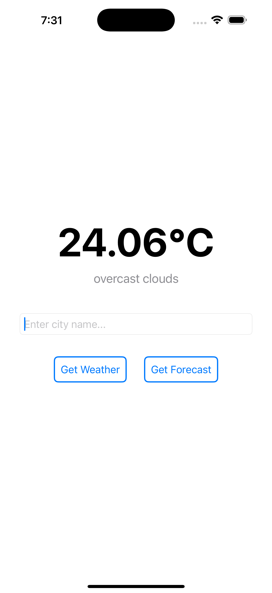

# WeatherForecast

1. Project Overview
      - The Weather Forecast App built with SwiftUI & Clean Architecture. Displays current weather and multi-day forecasts for the searched cities.

2. Features
      - Search for weather of a city
      - Search for forecast of a city

3. App Architecture
     * The project follows Clean Architecure & MVVM, along with SOLID principles organized into distinct layers.
     - Presentation -> SwiftUI Views, ViewModels
     - Domain -> Entities, Interface, UseCases
     - Data -> Network, Repository, ResponseModels
     - Core -> APIClient, APIConfig

4. Technical Specifications
     - Architecture: Clean Architecture + MVVM
     - Xcode: 16+
     - Minimum iOS: 15.0
     - Swift version: 6.1
     - Independent layers for Scalability, Maintainability, and Testability
     - Unit Tests added for core components
  
5. API Usage
     - Data is fetched from OpenWeatherMap.

6. Setup Instructions
    - Clone this repo.
    - Open WeatherNow.xcodeproj in Xcode.

7. Notes
    - Clean architecuture along with SOLID principles.

### Current Weather

